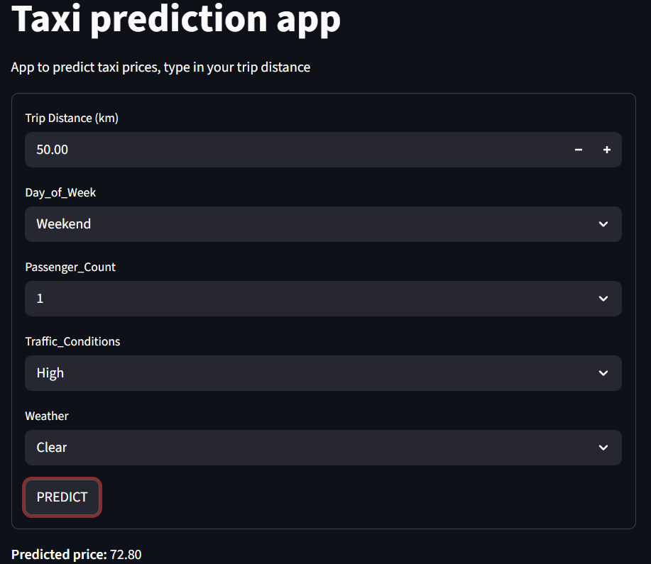
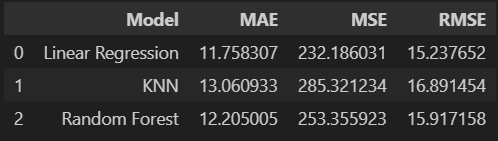
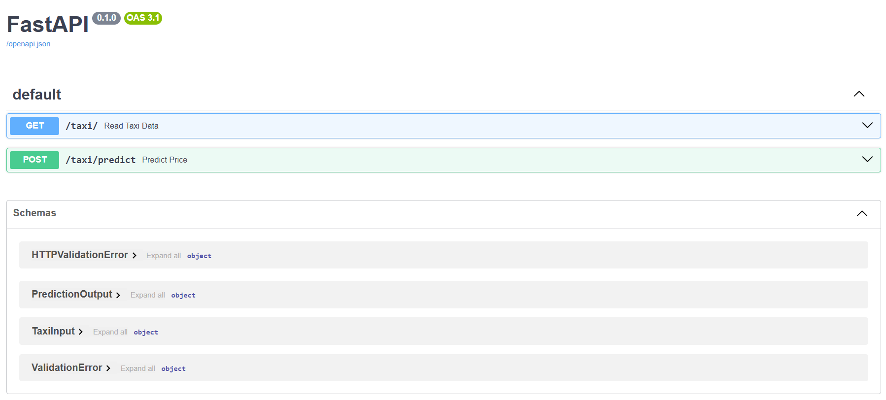
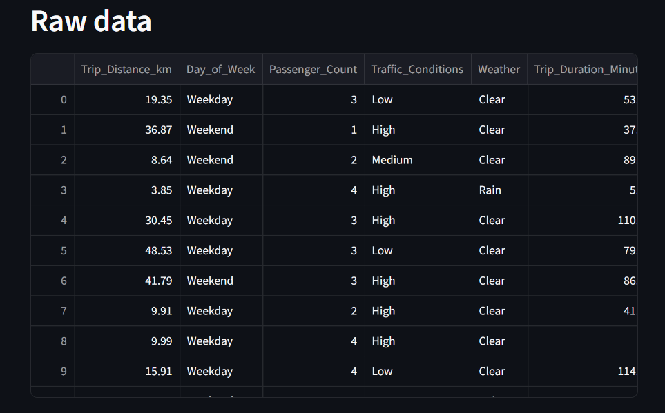
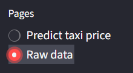

# Taxi prediction app
### In this project I developed an api and a streamlit application to predict taxi prices during different conditions.

#
# EDA

### I started with the EDA where I Cleaned my data, first I looked into the data to find the label and features and I saw quickly that Trip_Price was going to be my label and all other columns should be my features. After I did a groupby to see wich columns that didn't make a big impact on the Trip_Price. I noticed that Time_of_Day didn't make such impact on the price so I removed it. After that I took a look at Per_Km_Rate and Per_Minute_Rate and calculated them with the Trip_Distance_km and Trip_Duration_Minutes and found out that the result didn't match the Trip_price, so I removed them as well. After that I removed all of the NaN values except the ones in Trip_Price so I could test my model on them later and calculate them. Then I did a histplot of Trip_Price to find outliers and removed all of the outliers, except the NaN values. Then I noticed that Base_Fare was a calculation of the price, wich means that the price is already known, so I removed it. At last I saved my cleaned data set as "cleaned_taxi_trip_pricing.csv".

# Model development

### In my model development I tested 3 models:

- Linear Regression
- KNN
- RandomForest

### The first thing I did was to split Trip_Price into different dataframes, one where all of Trip_Price NaN values was and the other one where Trip_Price has values. After that I splitted the data into X(features) and y(label). Then I did train test split to get X and y train and X and y test. Since there is numerical and categorical data, I had to convert the categorical data into numerical data with columntransformer. After that started with Linear Regression and created a pipeline beause it makes the code easier and more clean and it was more simple to do with mixed data. Pipeline does things automaticly like scale and dummies and it guarantees no data leakage. Then I trained the train data and predicted the X_test data. I did MAE, MSE and RMSE on the data to see how much error it has, how big the error gap is. After that I started with KNN and did the exact same things. I started with pipeline, then did the data training and prediction, and last the MAE, MSE and RMSE calculation. Then I started with RandomForest and did the same steps I did on Linear Regression and KNN. After that it was time to choose model. I chose Linear Regression because it had the lowest result in MAE, MSE and RMSE . Then I took my lr_model and trained the model so I could test it out. Then I predicted Trip_Price NaN values and concatinated the predicted price into the dataframe. After that I saved the Linear Regression model with joblib. 

#

# Backend

## Data processing

### In backend I started with data_processing. I created 3 different classes:

- TaxiInput
- TaxiData
- PredictionOutput

### TaxiInput is like a blueprint of the data input structure. I put in all the columns and capped them so you can't put in negative values or absolute values, for the string ones (and passenger count) I typed in all of the different outcomes it have, and I set a default value. Then I did a calculation for how long the trip is going to take, so the user don't have to put it in themselves. Then I did the TaxiData that just shows you the dataframe. And after that I did PredictionOutput wich returns the predicted output in the api. 

## API 
- to open api you need to first install the venv(the packages in venv) then cd into the backend directory and type "uv run uvicorn api:app --reload" in the terminal

### In api I did 2 endpoints. The first one /taxi is just to read the dataframe where I used my TaxiData class. The second enpoint is /taxi/predict where the user inputs their information and get the predicted price back with the TaxiInput class and the PrediciotnOutput class. 

# Frontend
- to open streamlit you need to run api and then open a new terminal, cd into frontend directory and then type in "streamlit run app.py"

### In my frontend I created my steamlit application. In my streamlit i have to pages, one called predict taxi price and one called raw data, and the first page predict the price while the other one just show you the raw data. I have all the column names and their different outcomes with selectbox except Trip_Distance_km so you just can click on the right one you want so there is no type error or value not found error. And it looks and feels nicer when you can just press on a box instead of typing in the information yourself. I have number_input for Trip_distance_km with max and min value (float) so there will be no errors. Then I have a predict button that activates when you press it, and then it gives you the predicte price. 

